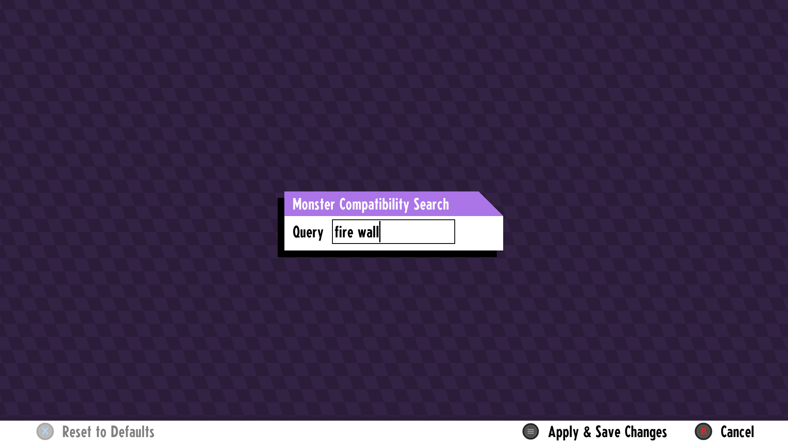

This mod lets you filter monsters by their allowed moves and tags in the bestiary menu.

Go to the bestiary menu and press Y to open the filter, then enter a comma seperated list of moves and/or :tags.
Tags use a colon in front because I thought a move might start with a # one day.

This is incompatible with anything that edits the BestiaryMenu, anything else should work fine.
There is no network or save tag, and it is safe to remove.

Thanks to NCrafters for help with exporting.

